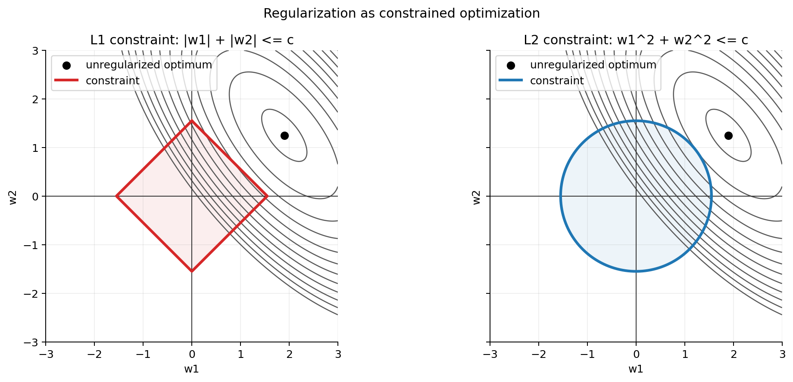

# Regularization

Regularization is how we tell a model: learn the signal in the data, but do not chase noise, quirks, or accidental patterns that only appear in the training set.

The same idea shows up in many forms: L1 and L2 penalties for linear models, weight decay and dropout in neural networks, early stopping during training, and complexity controls in tree-based models. The common thread is that the model has to pay a price for flexibility.

## Core Intuition

A model can reduce training error in two very different ways:

- It can learn real signal.
- It can memorize noise, quirks, and accidents in the training data.

Regularization adds pressure against the second behavior. It usually works by penalizing or constraining model flexibility, so a model only uses extra flexibility when it reduces prediction error enough to justify the added variance risk.

A useful mental model:

- Training loss asks: how well do you fit the data I gave you?
- Regularization asks: did the model rely on large weights, too many active features, too much training time, or too much flexibility to get that fit?
- Validation loss asks: does the learned pattern reduce error on data that was not used to fit the parameters?

## Regularization as an Objective

Without regularization, many models are trained by empirical risk minimization:

\[
\min_\theta \frac{1}{n}\sum_{i=1}^{n} L(y_i, f_\theta(x_i))
\]

Regularization adds a penalty term:

\[
\min_\theta \frac{1}{n}\sum_{i=1}^{n} L(y_i, f_\theta(x_i)) + \lambda \Omega(\theta)
\]

where:

- \(L\) measures prediction error.
- \(\Omega(\theta)\) measures the property we want to discourage, such as large weights, many active features, rough functions, or excessive flexibility.
- \(\lambda\) controls the strength of that penalty relative to the data-fit term.

Bigger \(\lambda\) means stronger regularization. If \(\lambda\) is too small, the model may overfit. If \(\lambda\) is too large, the model may underfit.

## Constraint Form

The penalty form has an equivalent constrained way to think about it:

\[
\min_\theta \frac{1}{n}\sum_{i=1}^{n} L(y_i, f_\theta(x_i))
\quad \text{subject to} \quad
\Omega(\theta) \leq c
\]

This says: find the best fitting parameters inside an allowed parameter-size, sparsity, or flexibility budget.

The geometry explains why different penalties behave differently:

- The loss contours show parameter values with equal error.
- The constraint region shows parameter values the regularizer allows.
- The solution is often where the smallest reachable loss contour touches the constraint region.
- L1 has corners, so the solution often lands on an axis, making some coefficients exactly zero.
- L2 is round, so it usually shrinks coefficients smoothly rather than setting them exactly to zero.

## L2 Regularization: Ridge and Weight Decay

L2 regularization penalizes the squared size of the weights:

\[
\Omega(w) = \|w\|_2^2 = \sum_j w_j^2
\]

For linear regression with mean squared error, ridge regression solves:

\[
\min_w \frac{1}{n}\|y - Xw\|_2^2 + \lambda \|w\|_2^2
\]

L2 usually does not make weights exactly zero. It shrinks them toward zero smoothly.

Where L2 shows up:

- Ridge regression.
- Logistic regression.
- Linear SVM-like objectives.
- Neural networks through weight decay.
- Matrix factorization and recommender systems.

For plain gradient descent, L2 and weight decay are closely related. With adaptive optimizers, decoupled weight decay is often preferred because the optimizer's adaptive scaling changes what a naive L2 penalty does.

## L1 Regularization: Lasso and Sparsity

L1 regularization penalizes the absolute size of the weights:

\[
\Omega(w) = \|w\|_1 = \sum_j |w_j|
\]

For linear regression, Lasso solves:

\[
\min_w \frac{1}{2n}\|y - Xw\|_2^2 + \lambda \|w\|_1
\]

The important behavior: L1 can make coefficients exactly zero.

That makes it useful when:

- We want feature selection.
- We have many features and expect only a few to matter.
- Interpretability matters.

But L1 has tradeoffs:

- With correlated features, it may pick one and discard another almost arbitrarily.
- It can be less stable than L2 when predictors contain similar information.
- It can underfit if the true signal is dense instead of sparse.

## Elastic Net

Elastic Net combines L1 and L2:

\[
\min_w \frac{1}{2n}\|y - Xw\|_2^2 + \lambda_1\|w\|_1 + \frac{\lambda_2}{2}\|w\|_2^2
\]

This gives two useful pressures at once:

- L1 can set coefficients to zero.
- L2 stabilizes the solution and handles correlated features more gently.

In practice, Elastic Net is often a good candidate for high-dimensional tabular data where sparsity is desirable but features are correlated.

## Regularization in Neural Networks

Neural networks can fit very flexible functions, so regularization is often needed when the training set is limited, noisy, or much smaller than the model capacity.

Common techniques include:

- Weight decay: penalizes large weights.
- Dropout: randomly removes hidden activations during training.
- Early stopping: stops training when validation loss stops improving.
- Gradient clipping: limits update size when gradients become unstable.
- Data augmentation: expands the effective dataset by adding transformed examples.
- Label smoothing: prevents classifiers from becoming too confident.
- Noise injection: adds random perturbations to inputs, activations, or weights.

### Weight Decay

For a weight matrix \(W\), an L2 penalty adds this term to the gradient:

\[
\nabla_W \left(\frac{\lambda}{2}\|W\|_2^2\right) = \lambda W
\]

So the total weight gradient becomes:

\[
\nabla_W L_{total} = \nabla_W L_{data} + \lambda W
\]

This pushes weights toward smaller values unless the data-fit term strongly argues otherwise.

### Dropout

During training, dropout randomly sets some hidden activations to zero. This prevents hidden units from relying too heavily on each other.

Using inverted dropout:

\[
\tilde{h} = h \odot m, \quad m_j \sim \frac{\text{Bernoulli}(1-p)}{1-p}
\]

At evaluation time, dropout is turned off. The inverted scaling keeps the expected activation size roughly consistent between training and evaluation.

### Early Stopping

Early stopping is regularization through optimization time. The model is not allowed to keep adapting to training noise forever.

The important detail is that early stopping watches validation loss, not training loss. Training loss can keep improving even after validation loss starts getting worse.

### Gradient Clipping

Gradient clipping is primarily a stability technique, especially in recurrent networks and transformers. It is not regularization in the same classical sense as L1 or L2, but it constrains update size and can prevent unstable parameter jumps.

Global norm clipping rescales the gradient when it is too large:

\[
g \leftarrow g \cdot \frac{c}{\|g\|_2} \quad \text{if } \|g\|_2 > c
\]

In practice, this is most useful when a model occasionally produces very large gradients. It keeps one bad step from throwing the whole training run off course.

### Other Neural Network Regularizers

- Data augmentation: teaches invariances by showing the model transformed versions of the same underlying example.
- Label smoothing: softens hard class targets, which can reduce overconfidence.
- Noise injection: perturbs inputs, activations, or weights so the model has to learn patterns that survive small disruptions.
- Batch normalization and layer normalization: mainly help optimization, but can have regularizing side effects. I think of those effects as secondary: useful, but not the main reason to use normalization layers.
